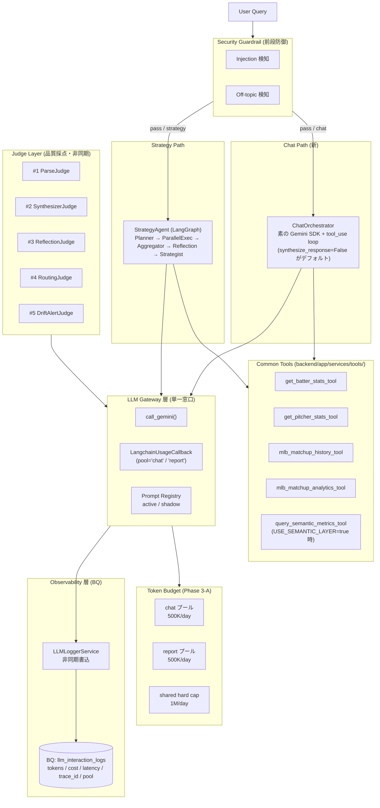
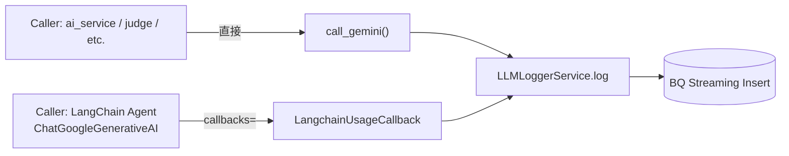
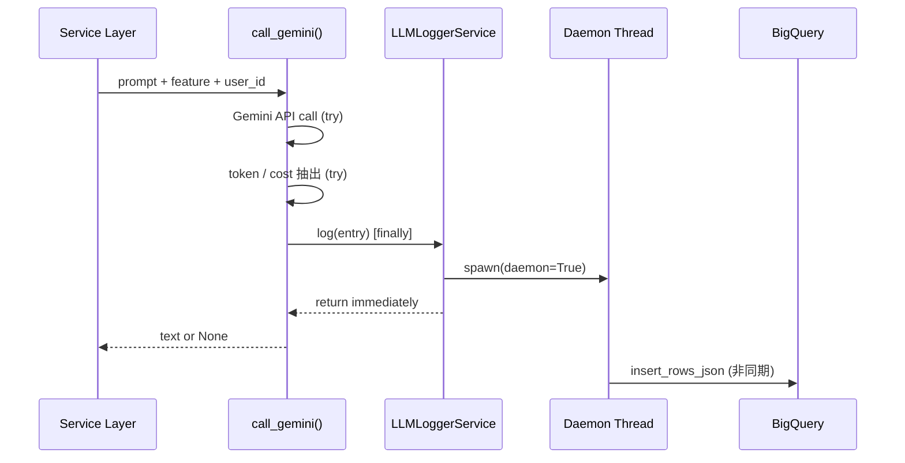
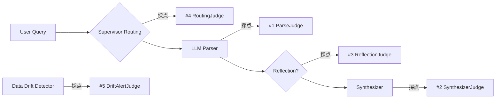
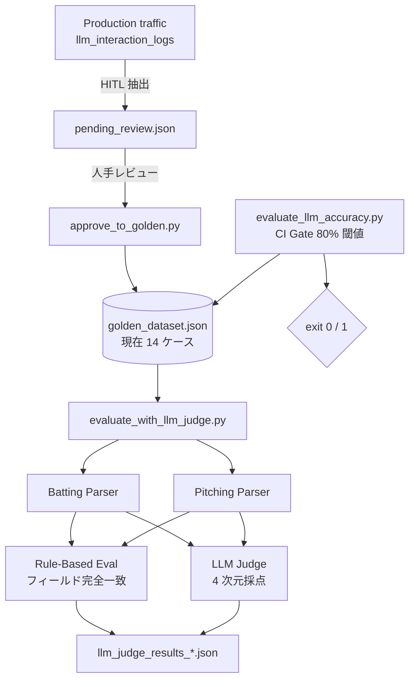
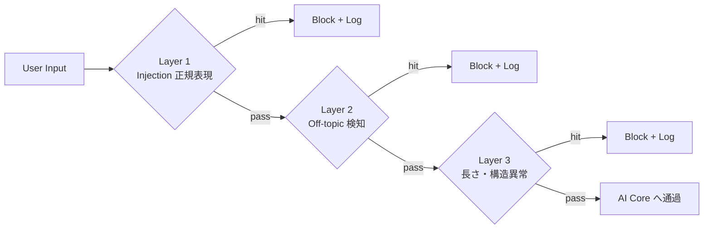
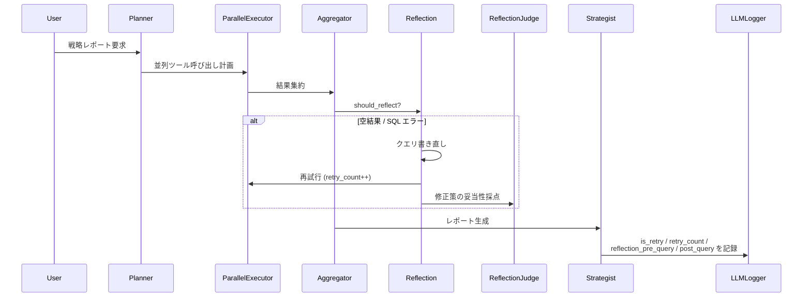
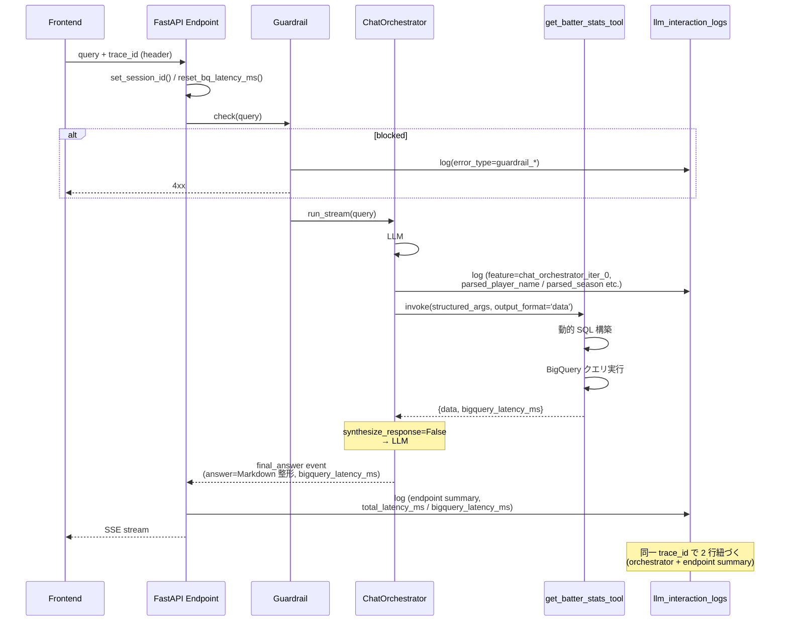

# Diamond Lens - AI / LLM Harness Architecture

> Diamond Lens における AI/LLM 機能と、その品質・コスト・安全性を担保する harness 層の設計図でございます。
> 既存の `README.md` / `README_JP.md` / `README_architecture.md` がプロダクト・インフラ全体を扱うのに対し、本ドキュメントは **AI コア部分のみ** を集中的に解説いたします。

---

## 目次

| Section | 内容 |
|---|---|
| [1. 全体像](#1-全体像) | AI コアと harness 層の俯瞰図 |
| [2. LLM Gateway](#2-llm-gateway-層) | 全 LLM 呼び出しの単一窓口 |
| [2.5. Context Caching](#25-context-caching) | Gemini Context Caching で input トークン課金を ~1/10 に削減 |
| [3. Logging & Cost Tracking](#3-logging--cost-tracking-層) | BigQuery への観測ログ |
| [4. Prompt Registry](#4-prompt-registry-層) | プロンプト版管理（active / shadow） |
| [5. Judge Layer](#5-judge-layer-llm-as-a-judge) | 5 種の LLM Judge |
| [6. Eval Pipeline](#6-eval-pipeline-ゴールデンデータセット) | ゴールデンセット & 回帰評価 |
| [7. Security Guardrail](#7-security-guardrail) | プロンプトインジェクション対策 |
| [8. Reflection Loop](#8-reflection-loop) | 自己修正フロー |
| [9. Request Lifecycle](#9-request-lifecycle-1-クエリの旅) | 1 クエリの旅 |
| [9.5. Token Budget プール分離](#95-token-budget-プール分離-phase-3-a) | chat / report 別予算管理 (Phase 3-A) |
| [9.7. Trace Viewer と失敗ラベリング](#97-trace-viewer-と失敗ラベリング) | 実行経路の閲覧・失敗ラベル付与 (ADR-053) |
| [10. CI/CD 統合状況](#10-cicd-統合状況とギャップ) | 現状とギャップ |
| [11. Glossary RAG](#11-glossary-rag-agentic-retrieval--llm-リランク) | 用語集の検索・リランク・評価 |

---

## 1. 全体像

> **2026-05-17 改訂**: チャット側を **`ChatOrchestrator` (素の Gemini SDK + tool_use ループ)** へ刷新。旧 `SupervisorAgent` + 4 sub-agent (Batter/Pitcher/Matchup/Stats) の LangGraph 構造を畳み、LLM 呼び出し回数を 4 回→ 2 回 (synthesize_response=False で 1 回) に削減。`StrategyAgent` のみ LangGraph 維持。

AI コアは **「Gateway を必ず通す → 自動でログ & コスト計測 → 別軸で Judge が品質採点」** という三層構造でございます。



### 設計の要

| 原則 | 実装 |
|---|---|
| LLM を呼ぶ＝Gateway を通る＝必ずログが書かれる | `call_gemini()` / `LangchainUsageCallback` / `ChatOrchestrator` の各 LLM 呼び出しが `LLMLogEntry` を `try/finally` で書く |
| ユーザー質問の NLU は **Orchestrator の LLM 自身** が責任を持つ | ツール内 `_parse_query_with_llm` (NLU 用 LLM) は廃止。LLM が tool_use で構造化引数を直接生成 |
| ツールは「動的 SQL → BQ フェッチ → 生データ返却」のみ | `output_format='data'` がデフォルト。ツール内の応答生成 LLM は呼ばない |
| Token Budget はチャット / レポートで分離 | プール別に超過判定し、レポート 1 本がチャット枠を枯渇させない (Phase 3-A) |

---

## 2. LLM Gateway 層

ファイル: [backend/app/services/llm_gateway_service.py](backend/app/services/llm_gateway_service.py)

### 役割

| 機能 | 実装 |
|---|---|
| Gemini 呼び出しの単一窓口 | `call_gemini(prompt, model, response_mime_type, feature, ...)` |
| トークン抽出 | `response.usage_metadata` から `input_tokens / output_tokens / cached_tokens` |
| コスト計算 | `PRICING` マップ（モデル別 USD 単価）から `estimated_cost_usd` を算出 |
| LangChain 経路の補足 | `LangchainUsageCallback` が `on_llm_end` を捕捉して同等のログを書く |
| エラーハンドリング | 例外を握り `None` を返す。ログには `error_type / error_message` を残す |

### 価格表（[llm_gateway_service.py:38-49](backend/app/services/llm_gateway_service.py#L38-L49)）

| モデル | input / 1M | output / 1M | cached / 1M | 備考 |
|---|---|---|---|---|
| gemini-2.5-flash | $0.30 | $2.50 | $0.03 | 本体（生成側）の既定モデル |
| gemini-3.6-flash | $0.75 | $3.75 | $0.075 | Judge の既定モデル。**プロモ価格。2027-01-01 に $1.50 / $7.50 / $0.15 へ倍増** |
| gemini-2.0-flash | $0.10 | $0.40 | $0.025 | **2026-06-01 提供終了**。過去ログのコスト再計算用に残置 |

価格は 2026-08-21 に [ai.google.dev/gemini-api/docs/pricing](https://ai.google.dev/gemini-api/docs/pricing) で確認。`_calc_cost_usd` は**未登録モデルをコスト 0 で記録する**（warning のみ）ため、モデル追加時は本表の更新が必須。

**Judge を生成側より上位のモデルに置いているのは意図的な判断**。LLM-as-a-Judge では採点側が被採点側より弱いと、微妙な事実誤認や論理の飛躍を検出できず採点が甘い方向に偏る。Judge は低頻度・入力 4000 字切り詰め・JSON 出力のため、上位モデルを使っても絶対額は小さい。

### 経路 2 系統



LangChain は SDK ラッパー越しに呼ぶため `call_gemini()` を経由いたしません。同等の観測性を保つため `LangchainUsageCallback` を別途用意し、`on_llm_end` で `usage_metadata` を抽出いたします。

---

## 2.5. Context Caching

ファイル: [backend/app/services/prompt_cache_service.py](backend/app/services/prompt_cache_service.py)

### 役割

Gemini Context Caching (`client.caches.create()`) を用いて、**長い固定プレフィックスをサーバ側に保持**し、リクエストでは動的サフィックスのみ送信する。`cached_per_1m_usd = $0.03` を活用し、input トークン課金を **~$0.30/M → ~$0.03/M (約 1/10)** に削減。

### 設計

| 機能 | 実装 |
|---|---|
| Cache 取得 | `get_or_create_cache(prompt_name, prompt_version, prefix_text, as_system_instruction=...)` |
| 一意キー | `(prompt_name, version, model, mode_tag, sha256(prefix_text)[:16])` |
| 二重作成防止 | `threading.Lock` で同時初回作成を直列化 |
| TTL 管理 | デフォルト 3600 秒。残り 5 分を切ったら自動再作成 |
| Fail-open | 作成失敗時は `None` を返し、caller は非キャッシュ経路にフォールバック |
| 登録モード 2 系統 | `as_system_instruction=False` (user contents) / `True` (system instruction) |

### 適用箇所

| 経路 | プロンプト | 登録モード | トークン数 | 削減効果 |
|---|---|---|---:|---|
| `_parse_query_with_llm` ([batter_services.py](backend/app/services/analytics/batter_services.py)) | `parse_query_v1.txt` の `# 本番` マーカー前 (instructions + examples) | user contents | ~2,250 tok | input ~97% がキャッシュヒット |
| `oracle_node` (Semantic Layer 経路、[batter_agents.py](backend/app/services/agents/batter_agents.py) / [pitcher_agents.py](backend/app/services/agents/pitcher_agents.py)) | `oracle_semantic_v1.txt` に metric/dimension vocab を baked in | system instruction | ~1,100-2,000 tok | 同上 (LangChain `.bind(cached_content=...)` 経由) |

### プロンプト分割パターン

```
parse_query_v1.txt:
  ┌──────────────────────────────┐
  │ instructions + JSON schema + │ ← cacheable prefix (>1,024 token)
  │ examples (10 個)              │   {current_year} は year 単位で baked in
  ├──────────────────────────────┤ ← `# 本番` マーカー (split 位置)
  │ # 本番                        │ ← dynamic suffix
  │ 質問: 「{query}」             │   毎リクエスト送信
  │ JSON:                         │
  └──────────────────────────────┘
```

### 制約

- **最小トークン数**: Gemini 2.5 Flash で 1,024 token、Pro で 2,048 token を下回ると `caches.create()` が拒否される
- **キャッシュストレージ料金**: $1.00/M token/hour (例: 2,250 tok × $1/M/hr ≈ $0.054/day)
- **In-memory dict**: Cloud Run の各インスタンスが個別にキャッシュを作成 (インスタンス間で共有しない)
- **`USE_SEMANTIC_LAYER=true`** 時のみ oracle 経路のキャッシュが発火 (= Cloud Run 本番)

### 計測

`llm_interaction_logs.cached_tokens` カラムに記録 (`call_gemini` 経路は `usage_metadata.cached_content_token_count` から、LangChain 経路は `LangchainUsageCallback._extract_usage` の `input_token_details.cache_read` から抽出)。

---

## 3. Logging & Cost Tracking 層

ファイル: [backend/app/services/llm_logger_service.py](backend/app/services/llm_logger_service.py)
テーブル: `tksm-dash-test-25.mlb_analytics_dash_25.llm_interaction_logs`

### スキーマ（抜粋）

| フィールド | 用途 | 埋まり方 |
|---|---|---|
| `log_id`, `timestamp` | 識別 | `LLMLogEntry.__init__` で自動生成 |
| `trace_id`, `request_id`, `user_id`, `endpoint`, `session_id` | 横断追跡 | **ContextVar から auto-populate** (caller の明示指定で上書き可) |
| `feature` | 集計軸 (例: `chat_orchestrator_iter_0`, `strategy_report`, `analytics_batter`) | caller が明示 |
| `user_query`, `resolved_query` | 入力側の文脈 | caller が `call_gemini(user_query=...)` で渡す |
| `prompt_name`, `prompt_version` | プロンプト版追跡 | caller が `get_prompt_version()` 経由で渡す |
| `parsed_query_type`, `parsed_metrics`, `parsed_player_name`, `parsed_season` | LLM のパース結果 | `call_gemini(post_response_hook=...)` で caller が転記 / Orchestrator は tool_use args から自動転記 |
| `routing_result` | (旧 Supervisor) ルーティング結果 | Phase 2 で実質非使用 |
| `response_answer`, `response_has_table`, `response_has_chart` | 出力 | `call_gemini` が自動 (`response_answer`)、caller が明示 (others) |
| `model`, `input_tokens`, `output_tokens`, `cached_tokens`, `estimated_cost_usd` | コスト追跡 | `usage_metadata` から自動 |
| `llm_latency_ms`, `total_latency_ms`, `bigquery_latency_ms` | パフォーマンス | LLM/全体時間は自動、BQ 時間は tool 戻り値経由 (ContextVar が StreamingResponse 配下で伝搬不能のため) |
| `is_retry`, `retry_count`, `retry_reason`, `reflection_pre_query`, `reflection_post_query`, `synthesizer_source_data` | Reflection Loop | **StrategyAgent のみ** 使用 (ChatOrchestrator は Reflection ノードを持たない) |
| `user_rating`, `feedback_category`, `feedback_reason` | HITL フィードバック | フィードバック API 経由で後追い UPDATE |
| `success`, `error_type`, `error_message` | 失敗観測 | `try/finally` で必ず記録 |
| `node`, `iteration`, `tool_calls` | **Trace Viewer (§9.7)** | エージェントのステップ単位で caller が明示。`tool_calls` は `LLMLogEntry.set_tool_calls()` が JSON 文字列化 |

> **`model IS NULL` の行が存在いたします。** ツール実行のように LLM を呼ばないステップも trace の一部として 1 行記録するためでございます。`usage_stats_service` は全クエリで `WHERE model IS NOT NULL` により LLM 行のみを集計しているため、コストダッシュボードには影響いたしません（§9.7 参照）。

### 書き込みフロー



ログ書込は別スレッドのため、API レスポンス速度に影響を与えません。フィードバック更新は Streaming Buffer の UPDATE 制約のため、`[FEEDBACK_UPDATE]` プレースホルダ行を別途 INSERT する設計でございます。

---

## 4. Prompt Registry 層

ファイル: [backend/app/config/prompt_registry.py](backend/app/config/prompt_registry.py)
プロンプト本体: [backend/app/prompts/](backend/app/prompts/)

プロンプトを **コードから外出し** し、active / shadow の 2 経路で版管理いたします。

### 登録済みプロンプト（2026-05 時点）

| prompt_name | active | shadow | 用途 |
|---|---|---|---|
| `parse_query` | v1 | — | 自然言語 → 構造化クエリ (legacy: batter_services._parse_query_with_llm 用) |
| `generate_response` | v1 | — | テーブル/チャート＋自然文応答 |
| `routing` | v2 | v2 | (旧) Supervisor のルート決定。Phase 2 で ChatOrchestrator に置換 |
| `strategy_planner` | v1 | — | Strategy Agent のプラン生成 |
| `strategy_synthesizer` | v1 | — | Strategy Agent のレポート合成 |
| `oracle_semantic` | v1 | — | Semantic Layer 用 Oracle（USE_SEMANTIC_LAYER=true 時に Cloud Run で使用） |
| `chat_orchestrator_system` | v1 | — | ChatOrchestrator のシステムプロンプト (`_build_system_prompt()` で動的構築) |

### 使い方

```python
# active 版（本番経路）
prompt = get_prompt("parse_query", query="大谷のHR数は？", season=2025)

# shadow 版（並走評価用）
shadow_prompt = get_prompt("parse_query", role="shadow", query="大谷のHR数は？")
```

`{key}` 形式のプレースホルダのみを明示的に置換するため、JSON テンプレート内の `{` `}` を壊しません。

---

## 5. Judge Layer (LLM-as-a-Judge)

AI コアの 5 つの判断ポイントに対し、それぞれ専用の LLM Judge を配置しております。全 Judge は **Gateway 経由** で Gemini を呼ぶため、Judge 自身の呼び出しコストも `llm_interaction_logs` に記録されます。



### Judge 一覧

| # | Judge | ファイル | 評価対象 | 主要次元 (1-5) | 閾値 |
|---|---|---|---|---|---|
| 1 | **Parse Judge** | [llm_judge_service.py](backend/app/services/llm_judge_service.py) | 自然言語 → 構造化クエリのパース精度 | query_type / metrics / entity / intent | overall ≥ 3.5 |
| 2 | **Synthesizer Judge** | [synthesizer_judge_service.py](backend/app/services/synthesizer_judge_service.py) | レポート・回答テキストの品質 | factual_accuracy / analytical_depth / language_quality / structure / completeness ＋ RAG 経路のみ context_relevance | overall ≥ 3.5 |
| 3 | **Reflection Judge** | [reflection_judge_service.py](backend/app/services/reflection_judge_service.py) | 自己修正トリガーと修正策の妥当性 | 過修正の有無を含む | — |
| 4 | **Routing Judge** | [routing_judge_service.py](backend/app/services/routing_judge_service.py) | Supervisor の routing 判断 | batter / pitcher / stats / matchup の分類精度 | — |
| 5 | **Drift Alert Judge** | [drift_alert_judge_service.py](backend/app/services/drift_alert_judge_service.py) | データドリフト統計検知のセカンドオピニオン | アクションが本当に必要か | ACTION_THRESHOLD ≥ 3.5 |

### Parse Judge の評価出力（例）

```json
{
  "case_id": "GD-001",
  "query_type_accuracy": 5,
  "metrics_accuracy": 4,
  "entity_resolution": 5,
  "intent_understanding": 5,
  "overall_score": 4.75,
  "passed": true,
  "reasoning": "メトリクスに不要な runs が追加されているが本質は正しい",
  "failure_category": "over_extraction"
}
```

`failure_category` は `unregistered_metric_key / entity_resolution_error / missing_context / schema_violation / over_extraction / type_misclassification` から 1 つを選択させ、後工程で集計いたします。

### Synthesizer Judge と RAG Triad

RAG の品質評価では **RAG Triad**（context relevance / groundedness / answer relevance の 3 点検査）が業界の定番でございますが、本プロジェクトでは専用フレームワーク（TruLens 等）を導入せず、**既存の評価資産に 3 辺を対応付ける**方針を採っております。

| RAG Triad の辺 | 何を問うか | 本プロジェクトでの実装 |
|---|---|---|
| Context Relevance | 引いてきた文書は質問に関係あるか | Synthesizer Judge の `context_relevance`（オンライン）＋ [run_retrieval_eval.py](backend/scripts/run_retrieval_eval.py) の hit@k / MRR（オフライン） |
| Groundedness | 回答は引いた文書に根拠を持つか | Synthesizer Judge の `factual_accuracy`。判定プロンプトに「元データ」として実際のツール戻り値を渡しているため、根拠照合として機能する |
| Answer Relevance | 回答は質問に答えているか | Synthesizer Judge の `completeness` |

**専用フレームワークを見送った理由**: 3 辺とも既存 Judge がカバーしており、導入すると依存ライブラリが増えるうえ同一項目を二重計上いたします。観点ごとに Judge を分ける本プロジェクトの設計とも噛み合いません。

**`context_relevance` の設計判断**:

| 論点 | 採用 | 理由 |
|---|---|---|
| RAG 非発火時の扱い | 採点基準ごとプロンプトから外し、`0`（評価対象外）を記録 | 文書を引かない成績照会に「文脈の関連度」を尋ねると、Judge が架空のスコアを返す |
| `overall_score` への算入 | **含めない** | 合格ライン 3.5 の意味が変わり、既存の蓄積データと比較できなくなる。プロンプトでも明示的に除外を指示 |
| 「対象外」と「判定失敗」の区別 | `retrieval_used`（BOOL）を別列で保持 | どちらも `0` になるため、列がないと集計時に切り分けられない |
| RAG 発火の判定方法 | ツール名（`RETRIEVAL_TOOLS = {"glossary_search_tool"}`） | 戻り値のキーで推測すると、別ツールが同じキーを返した瞬間に黙って挙動が変わる。`SYNTHESIS_REQUIRED_TOOLS` と同じ思想 |

追加の LLM 呼び出しは発生しません（既存 1 コールに採点項目が 1 つ増えるのみ）。結果は BQ `online_judge_verdicts` の `context_relevance` / `retrieval_used` 列に蓄積し、低スコアの質問を [retrieval_fixtures.json](backend/tests/golden/retrieval_fixtures.json) の追加候補として拾い上げます。

---

## 6. Eval Pipeline (ゴールデンデータセット)

オフライン評価の構造でございます。



### ファイル

| ファイル | 役割 |
|---|---|
| [backend/tests/golden_dataset.json](backend/tests/golden_dataset.json) | 14 ケース（季打 / 季投 / splits / 通算） |
| [backend/tests/pending_review.json](backend/tests/pending_review.json) | HITL レビュー待ちキュー |
| [backend/scripts/extract_golden_dataset.py](backend/scripts/extract_golden_dataset.py) | BQ ログから候補を抽出 |
| [backend/scripts/approve_to_golden.py](backend/scripts/approve_to_golden.py) | レビュー済みを Golden へ昇格 |
| [backend/scripts/evaluate_with_llm_judge.py](backend/scripts/evaluate_with_llm_judge.py) | ルールベース + Judge 並列実行 |
| [backend/scripts/evaluate_llm_accuracy.py](backend/scripts/evaluate_llm_accuracy.py) | CI 用ゲート（accuracy ≥ 80% で exit 0） |
| [backend/tests/test_llm_evaluation.py](backend/tests/test_llm_evaluation.py) | Golden の構造検証（LLM 非依存） |

### テストケース構造

```json
{
  "id": "GD-001",
  "category": "season_batting",
  "query": "2025年のホームラン王は誰？",
  "season": null,
  "expected": {
    "query_type": "season_batting",
    "metrics_contains": ["homerun"],
    "season": 2025,
    "order_by": "homerun",
    "name": null
  }
}
```

---

## 7. Security Guardrail

ファイル: [backend/app/services/security_guardrail.py](backend/app/services/security_guardrail.py)

LLM に到達する**前段**でユーザー入力を 3 層で検査いたします。



| Layer | 対象 |
|---|---|
| 1 | "ignore previous instructions" 等の上書き試行（日英両対応） |
| 2 | MLB ドメイン外（料理・天気・コーディング依頼など）の検知 |
| 3 | 異常な入力長・制御文字・反復構造 |

ブロック時も `llm_interaction_logs` に `error_type = guardrail_*` で記録され、傾向を分析可能でございます。

---

## 8. Reflection Loop

> **2026-05-17 改訂**: チャット側 (`ChatOrchestrator`) は Reflection ノードを廃止し、LLM の自然な再試行能力に委ねる設計に変更。`StrategyAgent` (LangGraph) のみ明示的な Reflection ノードを維持。

### StrategyAgent の Reflection (現役)

`should_reflect()` でリトライ要否を判定し、必要なら **クエリを書き直して再実行** する自己修正フローでございます。



### ChatOrchestrator の挙動 (Phase 2.5 以降)

ChatOrchestrator は Reflection ノードを持たず、以下のフローで自然な再試行を実現いたします:

1. LLM #1 が tool_use で構造化引数を生成
2. ツール実行 → 空結果やエラー
3. LLM が結果を見て自発的に引数を見直し、再度 tool_use (MAX_TOOL_ITERATIONS=6 まで)
4. 必要データが揃ったら `final_answer`

明示的な Reflection ノードを置かない理由は **「LLM が自分で再試行判断する方が柔軟」** だからでございます。system prompt に「空結果やエラー時は引数を見直して 1〜2 回まで再試行してください」と明記。

---

## 9. Request Lifecycle (1 クエリの旅)

> **2026-05-17 改訂**: ChatOrchestrator 経路に刷新。LLM 呼び出しが旧 4 回 → 新 1 回 (synthesize_response=False 時) に削減。

### チャット経路 (`POST /api/v1/qa/agentic-stats-stream`)



### Strategy 経路 (`POST /api/v1/strategy-report`)

`StrategyAgent` (LangGraph) は Planner → ParallelExecutor → Aggregator → Reflection → Strategist の 5 ノード構成を維持。

### ContextVar による横断トレース

`trace_id` / `request_id` / `user_id` / `endpoint` / `session_id` は `backend/app/middleware/request_context.py` の ContextVar で各ステージに伝搬されるため、1 クエリで発生した複数の LLM 呼び出しを BQ 側で `JOIN` できます。`LLMLogEntry.__init__` で auto-populate されるため caller の明示指定は不要でございます。

---

## 9.5. Token Budget プール分離 (Phase 3-A)

ファイル: [backend/app/services/token_budget_service.py](backend/app/services/token_budget_service.py)

**Phase 3-A** で Token Budget を **chat / report の 2 プール** に分離いたしました。レポート 1 本生成 (StrategyAgent は数千トークン消費) でチャット枠も枯渇する旧設計の問題を解消。

### プール構成

| プール | 用途 | 既定上限 (settings.py) |
|---|---|---|
| `chat` | ChatOrchestrator 経由の LLM 呼び出し | `LLM_DAILY_TOKEN_BUDGET_CHAT=500_000` tokens/day |
| `report` | StrategyAgent / strategy-report エンドポイント / tactics 等 | `LLM_DAILY_TOKEN_BUDGET_REPORT=500_000` tokens/day |
| `shared` | 上記合算の hard cap (旧 `LLM_DAILY_TOKEN_BUDGET` 互換) | `LLM_DAILY_TOKEN_BUDGET=1_000_000` tokens/day |

### API

```python
svc = get_token_budget_service()

# 計上
svc.record_usage(tokens=1234, pool="chat")
svc.record_usage(tokens=5678, pool="report")

# 判定 (プール超過 OR shared 超過のいずれかで True)
svc.is_budget_exceeded(pool="chat")
svc.is_budget_exceeded(pool="report")

# 残量
svc.get_remaining(pool="chat")
```

### 各 caller のプール指定

| 呼び出し元 | pool |
|---|---|
| `ChatOrchestrator` (各 LLM 呼び出し後) | `"chat"` |
| `LangchainUsageCallback(feature="strategy_report", pool="report")` | `"report"` |
| `LangchainUsageCallback(feature="strategy_tactics", pool="report")` | `"report"` |
| `ai_analytics_endpoints` の budget チェック | `is_budget_exceeded("chat")` |
| `strategy_report_endpoints` の budget チェック | `is_budget_exceeded("report")` |

ログには `pool` フィールドが入る `token_budget_recorded` イベントが構造化記録されます。

---


---

## 9.7. Trace Viewer と失敗ラベリング

ファイル: [backend/app/services/trace_query_service.py](backend/app/services/trace_query_service.py) / [trace_label_service.py](backend/app/services/trace_label_service.py) / [backend/app/api/endpoints/trace_endpoints.py](backend/app/api/endpoints/trace_endpoints.py) / [frontend/src/components/TraceViewer.jsx](frontend/src/components/TraceViewer.jsx)

§9 の `trace_id` は「束ねられる状態」を作りましたが、**読む面がございませんでした**。実際の調査は BQ コンソールに SQL を手打ちする運用でした。ここを画面にしたのが本セクションでございます。詳細な判断経緯は [ADR-053](docs/adr/053-agent-trace-viewer-failure-labeling.md) を参照ください。

### 記録されるステップ

`ChatOrchestrator` は LLM を呼ぶ箇所が 1 つしかなく、**返ってきたものが `function_call` かテキストかで役割が変わります**。そのため `node` は応答内容を見てから確定いたします。

| `node` | 意味 | `model` |
|---|---|---|
| `oracle` | どのツールを使うか LLM が判断した回 | 有 |
| `executor` | 選ばれたツールを実行した（**LLM 呼び出しではない**） | **NULL** |
| `synthesizer` | ツール結果を LLM が文章化した回 | 有 |

`executor` 行の `tool_calls` には `{name, ok, error, latency_ms}` を実行ツール分格納いたします。**ツールが失敗しても後続の LLM が何か答えてしまう**ため、応答だけを見ても失敗は分かりません。この行が失敗の唯一の証跡でございます。

### 質問の種類で経路が変わる

```
成績照会 :  oracle → executor            （2 ステップ / LLM 1 回）
                     ↑ 数値の羅列は機械整形するため synthesizer が発生しない

用語集   :  oracle → executor → synthesizer （3 ステップ / LLM 2 回）
                     ↑ SYNTHESIS_REQUIRED_TOOLS により文章化が必須
```

用語集経路で 2 周目に入るのは**再試行ではなく設計上必須の文章化**でございます。UI 上で警告色にしていないのはこのためでございます。

「1 回目のツールでは足りず追加でツールを呼んだ」ケースは、**`oracle` が 2 回以上出現する**ことで判別いたします。

### API

| エンドポイント | 用途 |
|---|---|
| `GET /api/v1/traces` | 一覧。`only_failed` / `only_unlabeled` で絞り込み。60 秒 TTL キャッシュ |
| `GET /api/v1/traces/{trace_id}` | 1 trace の全ステップ |
| `GET /api/v1/traces/compare?a=&b=` | 2 trace のノード列・ツール列の比較 |
| `GET /api/v1/traces/labels` | ラベル軸の定義（フロントでのハードコード回避） |
| `POST /api/v1/traces/{trace_id}/label` | ラベル付与 |

### ラベル軸（`trace_labels` テーブル）

`correct` / `wrong_tool` / `wrong_params` / `right_answer_wrong_path` / `should_have_abstained` / `retrieval_miss` / `tool_error`

**追記のみ**でございます。ログ本体は書き換えず、付け直しは新しい行の INSERT で表現し、読み出し側が `labeled_at` の最新を採用いたします。「いつ判断が変わったか」を残すためでございます。

### 既知の制約

- **`iteration` 列の意味が経路で揃っておりません。** `ChatOrchestrator` では LLM 呼び出しの通し番号、`StrategyAgent` では reflection の `retry_count` でございます。そのため一覧の「LLM 呼び出し回数」は `COUNTIF(model IS NOT NULL)` で数え直しております
- **`MAX_TOOL_ITERATIONS` (6) による打ち切りが trace 上で判別できません。** 上限到達は「黙った」のではなく「調べ切れなかった」であり、通常終了と区別すべき事象でございます
- **エンドポイントが書くサマリ行は `node IS NULL`** でございます。`LLMLogEntry` はインスタンス生成時に timestamp を打つため、リクエスト受信直後に生成して処理完了後に書き込むこの行は「時刻は最古・中身は最終結果」になります。ステップ列に混ぜると順序が壊れるため `summary` として分離しております
- **`StrategyAgent` 側も同じ計装を実装済みでございますが、現行 UI から到達しないため trace は蓄積されません**（[ADR-053](docs/adr/053-agent-trace-viewer-failure-labeling.md) Context 参照）

## 10. CI/CD 統合状況とギャップ

### 現状

| 項目 | 状態 | 場所 |
|---|---|---|
| Unit test | コメントアウト | [cloudbuild.yaml:6-16](cloudbuild.yaml#L6-L16) |
| Schema validation gate | コメントアウト | [cloudbuild.yaml:20-32](cloudbuild.yaml#L20-L32) |
| **LLM accuracy gate** | **コメントアウト** | [cloudbuild.yaml:37-50](cloudbuild.yaml#L37-L50) |
| ML data drift gate | コメントアウト | [cloudbuild.yaml:53-66](cloudbuild.yaml#L53-L66) |
| Backend / Frontend deploy | 稼働中 | [cloudbuild.yaml:176-294](cloudbuild.yaml#L176-L294) |

評価スクリプト自体は完成しておりますが、Cloud Build の該当ステップが**丸ごとコメントアウト**されているため、現状 CI ゲートとしては機能しておりません。

### 未着手の領域

| 領域 | 内容 |
|---|---|
| baseline 比較 | 前回スコアとの差分による回帰検知（`-2%` 劣化で fail 等） |
| per_category recall / confusion matrix | カテゴリ別精度の可視化 |
| Judge 結果の BQ 化 | 現在は JSON ファイル出力。BQ テーブル化で時系列追跡が可能になる |
| 自由文出力への Judge 適用拡張 | 現状 Parse Judge は構造化出力のみ。chat 自由文への rubric ベース Judge は未実装 |
| しきい値の校正 | `PASS_THRESHOLD=3.5`, `SIMILARITY_THRESHOLD=0.15`, PSI `0.1 / 0.2` は経験則 |

---

## 11. Glossary RAG (Agentic Retrieval + LLM リランク)

### 役割

用語定義の質問に、**非構造テキストの検索**で答える層。数値集計は SQL ツールが担当するため、RAG の担当範囲は意図的に狭く切ってある。

```
質問 → ChatOrchestrator が要否を判断（Agentic RAG。常時検索しない）
     → LLM が category を選択（batting / pitching / statcast）
     → BQ で埋め込み生成 + ML.DISTANCE（COSINE）
     → 候補 10 件 → 閾値 0.275 → Gemini がリランク → 上位 5 件
     → LLM が要約 → 出典を機械的に付加
```

### 埋め込みの非対称性

| 側 | task_type |
|---|---|
| 文書（取り込み時） | `RETRIEVAL_DOCUMENT` |
| 質問（検索時） | `RETRIEVAL_QUERY` |

同一モデル（`text-multilingual-embedding-002`）で用途に応じた別の埋め込みを生成する。日本語の質問で英語混じりの文書を引くため、多言語モデルは必須。

### チャンク設計

- `## 見出し` 1 つ = 1 チャンク（自然境界）。見出し語をチャンク先頭に含める
- **メタデータはベクトル化対象から外す**。カテゴリ・メトリクス名・検証ステータスは別カラムへ。全チャンク共通の定型文はチャンク間の識別力を下げるため
- 冪等性は `source` 単位の DELETE→INSERT

### リランク（[rerank_service.py](backend/app/services/rerank_service.py)）

- 本文は先頭 300 字のみ渡す。全文はトークンが嵩むだけで精度は上がらない
- LLM には**候補番号の配列だけ**返させる。本文を再生成させると遅く高価で、改変のリスクもある
- 範囲外・重複の番号は捨てる（LLM 出力は保証されない）
- `call_gemini`（[LLM Gateway](#2-llm-gateway-層)）経由。直接 SDK を叩くとコスト計上が漏れる
- 失敗時はベクトル検索の順序をそのまま返す（fail-open）

### 応答合成の切り替え

用語集の結果は生データではなく文章のため、**ツール名で合成の要否を判定**する。

```python
SYNTHESIS_REQUIRED_TOOLS = frozenset({"glossary_search_tool"})
```

戻り値のキー（`sources` 等）で推測すると、将来別のツールが同じキーを返した瞬間に挙動が黙って変わる。成績照会は従来通り機械整形（LLM 呼び出しを増やさない）。

出典は `_append_sources` が機械的に付加する。system prompt での指示は「だいたい守られる」に留まり、実際に要約の過程で落ちた事例がある。

### 評価（[run_retrieval_eval.py](backend/scripts/run_retrieval_eval.py)）

| 指標 | 定義 |
|---|---|
| 命中率 hit@k | 上位 k 件に正解が 1 件でも入った質問の割合（RAG 文献の Recall@k） |
| 網羅率 recall@k | 正解集合のうち上位 k 件に入った割合（ML の定義通り） |
| MRR | 正解の最上位順位の逆数の平均 |
| 誤発火率 | 検索不要な質問でツールが呼ばれた割合（[run_misfire_eval.py](backend/scripts/run_misfire_eval.py)） |
| context_relevance | 引いた文書の質問との関連度（1-5）。**本番トラフィックに対する Synthesizer Judge のオンライン採点**。上 4 つはオフラインのゴールデンセット 13 問に対する指標だが、これのみ実トラフィックを測る（[Judge Layer](#5-judge-layer-llm-as-a-judge) 参照） |

質問側の埋め込みを BQ にキャッシュしているため、構成比較を何度回しても追加課金は発生しない。

**実測（13 問）**

| | 命中@3 | 命中@5 | MRR |
|---|---:|---:|---:|
| ベクトル検索のみ | 0.615 | 0.769 | 0.585 |
| + リランク | **0.769** | **0.923** | **0.762** |

誤発火率 **0.000**。用語名を含む質問（direct 型）は命中@3 が 1.000。

### 閾値では精度が上がらないことの実証

| 対象 | min | p50 | max |
|---|---:|---:|---:|
| 正解チャンク | 0.1816 | 0.2261 | 0.2542 |
| 最上位の不正解 | **0.1684** | 0.2363 | - |

**最近傍の不正解が最近傍の正解より近い。** 距離分布が重なっているため、どこに線を引いても分離できない。閾値は「明らかな無関係を切る」役割に留まる——この実測がリランク採用の直接の根拠。

### Tier 2（公式ルール PDF）の復帰とクロスリンガル対策

`rules`（897 チャンク）は 2026-08 時点で「rule 型の命中@3 が 0.333 で頭打ち」として `EXCLUDED_CATEGORIES` で無効化していた。2026-09 に再調査した結果、**この数字自体が測定バグ**だった。

ゴールデンセットが正解に指定していた `#6.02(a)` の中身は次の 134 字だけで、ボークの条件は `6.02(a)(1)`〜`(13)` の別チャンクにあった。

```
(a) Balks
If there is a runner, or runners, it is a balk when:
```

検索がそれらを返しても不正解と記録され、この空のリード文の順位（414 位）をもって「壊滅的」と判断していた。ラベルを是正すると同じ質問が 25 位になった。

#### 日英ギャップの定量化

用語集（`docs/knowledge/*.md`）は日本語で執筆しているため **日本語 × 日本語**、ルール PDF だけが **日本語 × 英語**である。この差を単一実験で測った。

`rule_020`「ストライクゾーンを外れた投球を4つ受けた打者はどうなりますか」／正解 `def:BASE ON BALLS`（本文に `receives four pitches outside the strike zone` を含む）:

| 検索に使った文字列 | 正解の順位 | 距離 |
|---|---:|---:|
| 日本語の質問そのまま | **212 位** | 0.3244 |
| 同義の英文 | **16 位** | 0.2450 |

**語彙が逐語対応していても、日本語のままでは 212 位。** 同時に、英語でも 16 位止まり（1 位 0.2190 との差は 0.026）であることから、897 チャンクが同一の法律英語を共有することによる識別力不足も併存している。

#### 対策と実測（rule 型 30 問、リランク ON）

| 構成 | 命中@3 | 命中@5 | MRR |
|---|---:|---:|---:|
| 閾値 0.275（用語集と同じ） | 0.600 | 0.667 | 0.580 |
| + rules 専用閾値 0.35 | 0.733 | 0.733 | 0.708 |
| **+ HyDE（英語の条文風に書き換えて埋め込む）** | **0.833** | **0.867** | **0.766** |

閾値 0.275 では候補が全て足切りされ、30 問中 15 問で**リランクが一度も起動していなかった**。「リランクを入れても rules は改善しない」という以前の観測は、この不発によるものだった。

HyDE は net でプラスだが万能ではない。用語名を答えさせる型（`rule_016` ランダウン）では書き換え文に用語が入らず 180 位へ悪化する。

詳細は [ADR-054](docs/adr/054-cross-lingual-rag-hyde-category-thresholds.md)。

---

## 関連ドキュメント

- [README.md](README.md) — プロダクト全体（英語）
- [README_JP.md](README_JP.md) — プロダクト全体（日本語）
- [README_architecture.md](README_architecture.md) — システム・インフラ全体
- [README_eval.md](README_eval.md) — 評価システム（4 層 + オンライン・Judge・ゴールデンセット・実測値）
- 本ドキュメント — AI / LLM レイヤー専用
