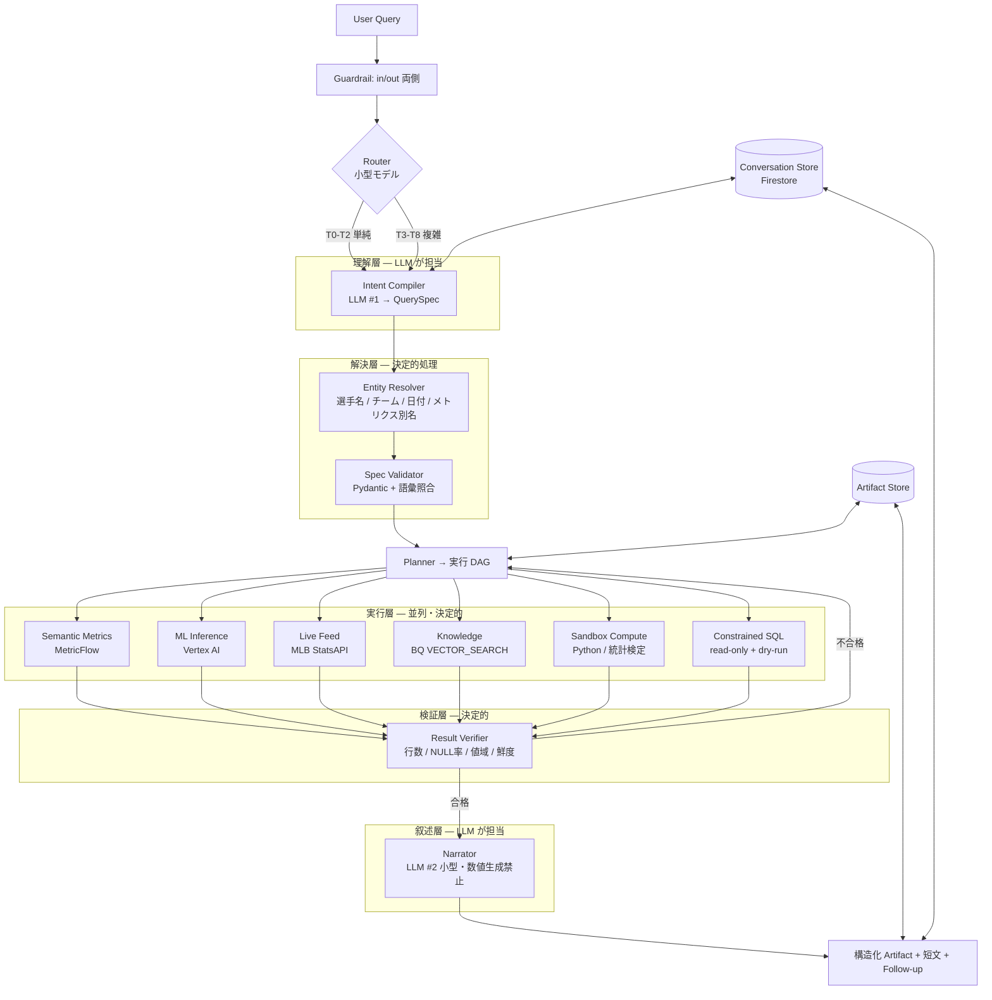

# Chat Architecture Redesign

**Objective: MLB に関するあらゆるクエリに、会話として答えられるチャット基盤へ**

| | |
|---|---|
| 対象 | `POST /api/v1/qa/agentic-stats-stream` → `ChatOrchestrator` を中心とするチャット系全体 |
| 前提技術 | 2026 年 8 月時点で調達可能なもののみ |
| 位置づけ | 現行 `README_ai_architecture.md` の後継設計。段階移行を前提とする |
| 作成日 | 2026-08-14 |

---

## 目次

1. [現状の限界](#1-現状の限界)
2. [Objective の定義 — クエリ階層](#2-objective-の定義--クエリ階層)
3. [ターゲットアーキテクチャ](#3-ターゲットアーキテクチャ)
4. [AI / 非 AI の境界線](#4-ai--非-ai-の境界線)
5. [データ基盤とパイプライン](#5-データ基盤とパイプライン)
6. [実行層 — 3 段構え](#6-実行層--3-段構え)
7. [会話状態とメモリ](#7-会話状態とメモリ)
8. [応答生成と UI](#8-応答生成と-ui)
9. [品質・評価・可観測性](#9-品質評価可観測性)
10. [セキュリティとコスト](#10-セキュリティとコスト)
11. [ロードマップ](#11-ロードマップ)
12. [技術選定](#12-技術選定)

---

## 1. 現状の限界

コード実測にもとづく棚卸し。致命度順。

| # | 限界 | 根拠 | 影響 |
|---|---|---|---|
| **A1** | **マルチターンが存在しない** | `run_stream()` は `contents` を毎回 `[user_query]` 1 件で初期化（`chat_orchestrator.py:478`）。`conversation_service` は旧 `ai_service.py` 経路にのみ接続され、`ChatOrchestrator` から呼ばれない | 「彼の RISP は？」が原理的に解決不能。実体はワンショット Q&A |
| **A2** | **リトライループが動作しない** | 既定 `synthesize_response=False` では iteration 0 のツール実行直後に `return`（`chat_orchestrator.py:644-663`）。`MAX_TOOL_ITERATIONS=6` は既定経路でデッドコード | 空結果・SQL エラーが自己修正されず、そのまま「データが取得できませんでした」 |
| **A3** | **LLM が回答文を書かない** | 既定経路は `_format_rows_as_markdown()` が `- runs_batted_in: 102` を列挙するのみ。system prompt の応答合成ルールは未使用のまま Context Cache に載り課金対象 | 分析の言語化という製品価値が失われている |
| **A4** | **ツール表面積が資産の 1/5** | `CHAT_TOOL_REGISTRY` は 4 ツール。一方 `router.py` に 18 ルーター、`services/` に 20 超のサービス（Stuff+ / 疲労度 / セグメンテーション / ライブ / Statcast / リーダーボード等） | 実装済み機能の大半がチャットから不可視 |
| **A5** | **語彙をプロンプトへ全量インライン** | `_get_valid_metric_keys()` が `METRIC_MAP` 全キーを system prompt へ注入 | メトリクス増加でプロンプト膨張・選択精度低下。数十件で頭打ち |
| **A6** | **構造化ペイロードがキー名の推測** | `_extract_structured_payload()` が `"pitch_name" in first` 等で型判定し、最初の table/chart で `break` | 複数ツールの結果を同時描画できない。ツール追加のたびに壊れる |
| **A7** | **会話状態が Redis blob / TTL 1h** | `get_chat_history` → 全読み → append → 直近 10 件に切って書き戻し | スレッド一覧・分岐・共有・永続化すべて不可。1 時間で消滅 |
| **A8** | **データ鮮度が週次** | Cloud Scheduler 日曜 6:00 JST → ETL → dbt（`README_architecture.md` Data Flow） | 「昨日の試合」「今の順位」に答えられない |
| **A9** | 出力形式制御が文字列連結 | `resolved_query = f"{body.query} 表で"`（`ai_analytics_endpoints.py:513`） | クエリ本文が汚染され、ログ・評価データに混入 |
| **A10** | モデル単一固定・直列実行 | `gemini-2.5-flash` 固定。`for fc in function_calls:` で逐次 | ルーティング／フォールバックなし。並列可能なツール呼び出しを直列化 |
| **A11** | CI 品質ゲートが全停止 | `cloudbuild.yaml` の精度ゲート・スキーマゲートがコメントアウト | 回帰検知ゼロ。自由文出力への Judge も未実装 |
| **A12** | Guardrail が入力側のみ | `security_guardrail` は入力検査のみ | ツール戻り値経由の間接注入・出力側漏洩が未防御 |

### 総括

観測基盤（Gateway 単一窓口 / BQ ログ / Judge 5 種 / Token Budget プール分離 / Context Caching）は同規模のプロジェクトとして先行している。一方でチャットの中核体験 —— **記憶・自己修正・言語化** —— がコスト最適化の副作用で削れており、しかも A1 / A2 はドキュメント記述と実装が乖離しているため外形からは検知しにくい。

---

## 2. Objective の定義 — クエリ階層

「あらゆるクエリに答える」を計測可能にするため、MLB 質問を 9 階層に分類する。**この表が設計の地図であり、進捗の物差しでもある。**

| Tier | 種別 | 例 | 必要機構 | 現状 |
|---|---|---|---|---|
| **T0** | 事実検索 | 「大谷の 2025 年打率は？」 | セマンティック層 | ✅ |
| **T1** | 比較・ランキング | 「2025 年 OPS トップ 10」 | 集計 + ソート | △ 部分的 |
| **T2** | 条件付き集計 | 「2 アウト得点圏での wOBA」 | 次元の組合せ | △ 部分的 |
| **T3** | 時系列・トレンド | 「7 月以降の調子は？」 | ローリング窓 + 基準比較 | ❌ |
| **T4** | 因果・説明 | 「なぜ打率が落ちた？」 | 統計検定 + 要因分解 + 叙述 | ❌ |
| **T5** | 予測 | 「明日の先発に対する期待被打率」 | ML 推論（Stuff+ / FT-Transformer 等） | ❌ チャット外 |
| **T6** | 反実仮想・戦略 | 「左投手にこの打順は最適か」 | シミュレーション + 推論 | ❌ 別画面 |
| **T7** | ライブ・即時 | 「今の試合、何回？」 | StatsAPI 直結 | ❌ 別画面 |
| **T8** | 知識・ルール・歴史 | 「サイ・ヤング賞の選出基準は？」 | RAG / 知識ベース | ❌ 無効化中 |

### 設計判断

- **T0–T2 は決定的処理に固定する**（後述 §4）。ここに LLM の裁量を残すと、最も頻度の高い帯域で精度が揺れる。
- **T3–T4 が最大の付加価値帯**。「調子」「不振の理由」は競合ダッシュボードが答えられない領域であり、LLM の言語化能力が正当に効く。
- **T5–T7 は既に資産がある**。`stuff_plus_service` / `pitcher_fatigue` / `live_game_service` を **ツールとして公開するだけ**で到達できる。実装ではなく接続の問題。
- **T8 は RAG 再開**（`chromadb` はイメージサイズ削減で無効化中 → BigQuery `VECTOR_SEARCH` へ移設すれば新規インフラ不要）。

---

## 3. ターゲットアーキテクチャ



### 中核となる 3 つの構造変化

| 変化 | 現状 | 提案 |
|---|---|---|
| **サンドイッチ構造** | LLM が NLU から SQL 引数生成まで一気通貫 | LLM は「意図の翻訳」と「結果の言語化」の**両端だけ**。中間はすべて決定的処理 |
| **Verifier ループ** | 空結果でも即返却（A2） | 決定的な検証器が不合格を出したら Planner へ差し戻す。LLM の善意に依存しない |
| **Capability Catalog** | 4 ツールを全宣言 + 語彙全量インライン | 20+ ツール／メトリクスを埋め込み検索し、top-k のみ宣言 |

---

## 4. AI / 非 AI の境界線

**本設計で最も重要な原則。** 現状はこの境界が両方向に誤っている。

### 原則

> **検証可能で決定性のある処理は、すべてコード側に置く。**
> **LLM は「曖昧な自然言語 → 構造化意図」と「構造化結果 → 自然文」の両端のみを担当する。**

### 割り当て表

| 処理 | 担当 | 理由 |
|---|---|---|
| 質問の意図分類 | **AI** | 曖昧性の解消は LLM の本領 |
| 「調子」「不振」等の主観語の操作定義への写像 | **AI** | 文脈依存。ただし定義候補は設定ファイルで列挙 |
| 代名詞・省略の解決 | **AI**（履歴を contents に積むのみ） | 追加 LLM 呼び出し不要 |
| フォローアップ質問の生成 | **AI** | |
| 結果の傾向の言語化 | **AI** | T3–T4 の付加価値の源泉 |
| — 境界線 — | | |
| **選手名の正規化**（愛称・日本語表記・typo） | **非 AI** | 辞書 + fuzzy match + 曖昧時のみ AI へ委譲。現状は LLM に「英語フルネームに正規化して」と依頼しており誤りが混入する |
| **メトリクス別名の解決**（`rbi` → `runs_batted_in`） | **非 AI** | エイリアス表で確定できる。現状は全キーを prompt に流し込み LLM に選ばせている（A5） |
| **日付・シーズンの解決**（「今年」「先週」） | **非 AI** | カレンダー演算。LLM に渡すと年跨ぎで誤る |
| **数値の計算・集計・ランキング** | **非 AI** | LLM に算術をさせない |
| **統計的検定・有意差判定** | **非 AI** | `statistical_analysis.py` / scipy |
| **閾値判定・アラート** | **非 AI** | 設定値で管理 |
| **SQL の実行** | **非 AI**（生成のみ AI 可、実行前に決定的検証必須） | read-only SA / dry-run / byte 上限 / allowlist |
| **結果の妥当性検証** | **非 AI** | 行数 0 / NULL 率 / 値域外 / 鮮度切れ を機械的に判定 |
| **最終回答中の数値** | **非 AI** | **Narrator に数値を再生成させない**（下記） |

### 数値ハルシネーションを構造的に断つ

```
❌ 現状の Full synth モード:  ツール結果 → LLM → 「大谷は 54 本塁打を記録しました」
                              （LLM が数値を再生成 = 誤記のリスク経路が残る）

✅ 提案:  ツール結果 → 構造化 Artifact → UI が数値を描画
                    ↘ Narrator → 「7 月以降、長打率が季節平均を上回って推移しています」
                                  （傾向のみ。数値プレースホルダはテンプレート束縛）
```

Narrator へのプロンプトから数値の直接記述を禁じ、必要な場合は `{{metric.homerun}}` 形式のプレースホルダのみ許可してサーバ側で差し替える。**これにより数値誤りの経路が物理的に消える。**

---

## 5. データ基盤とパイプライン

### 現状の構造

```
MLB StatsAPI / Statcast → ETL (Cloud Run) → BQ raw
  → dbt staging → intermediate → core (incremental) → marts
  → MetricFlow (Cloud Run) → Backend
実行: Cloud Scheduler 日曜 6:00 JST（週次）
```

### 問題

週次バッチ単一速度では T7（ライブ）はもちろん、**T3（トレンド）も最大 7 日遅延**する。「あらゆるクエリ」の前提として成立しない。

### 提案 — 3 速度層

| 層 | 更新頻度 | 対象 | 実装 | 用途 |
|---|---|---|---|---|
| **Hot** | 秒〜分 | ライブスコア、当日出場、進行中の試合状況 | MLB StatsAPI 直叩き + Redis 30s キャッシュ | T7 |
| **Warm** | 日次（毎朝） | 前日の試合結果、Statcast 増分、順位表 | Cloud Scheduler → 増分 ETL → dbt incremental（対象モデルのみ） | T1–T4 |
| **Cold** | 週次 | 全期間再計算、ML 再学習、バックフィル、データ品質テスト | 現行パイプライン維持 | T5–T6 |

各テーブルに `_freshness_ts` を持たせ、**Verifier が鮮度を検査**して「このデータは 2026-08-13 時点」を回答に必ず添付する。鮮度の明示は信頼性の中核。

### 追加すべきデータ資産

| 資産 | 内容 | 用途 | 実装 |
|---|---|---|---|
| **Entity Registry** | 選手・チーム・球場の別名辞書（英名／日本語／愛称／表記ゆれ／MLBAM ID） | 入口の正規化。全 Tier の精度を規定する | BQ テーブル + インメモリ索引 + `rapidfuzz` |
| **Capability Catalog** | 全ツール・全メトリクス・全次元の説明文とその埋め込み | ツール retrieval（A5 の根治） | BQ + `VECTOR_SEARCH`（`bq_embedding_service` 転用） |
| **Knowledge Base** | ルール、用語定義、球場特性、賞の選出基準、球団史 | T8 | 同上。`rag_service.py` を BQ ベクトル検索へ移設 |
| **Query Log Mart** | 本番質問 + 意図 + 結果 + フィードバック | 評価セット自動拡充、カバレッジ計測 | 既存 `llm_interaction_logs` + `/qa/feedback` を dbt で mart 化 |

### セマンティック層の役割拡張

MetricFlow（現在 `USE_SEMANTIC_LAYER=false`）を **ON 前提**とし、以下を単一の真実の源とする。

- メトリクス定義（計算式・単位・許容値域・上位下位の意味）
- 次元と有効な組合せ
- メトリクスのエイリアス（`rbi` / `打点` / `RBI` → `runs_batted_in`）

これにより §4 の「メトリクス別名の解決は非 AI」が実装可能になり、プロンプトへの語彙インライン（A5）が不要になる。

---

## 6. 実行層 — 3 段構え

「あらゆるクエリ」を成立させるには、単一の実行機構では不足する。**表現力とガバナンスをトレードオフした 3 段**を用意し、上から順に試す。

| 段 | 機構 | 対象 | 表現力 | 安全性 | レイテンシ |
|---|---|---|---|---|---|
| **1** | 構造化ツール（Semantic Metrics / ML / Live / RAG） | T0–T2, T5, T7, T8 | 中 | 高（定義済みのみ） | 低 |
| **2** | サンドボックス計算（Python） | T3–T4, T6 | 高 | 中（隔離実行） | 中 |
| **3** | 制約付き生成 SQL | ロングテール | 最高 | 要制御 | 中〜高 |

### 段 1 — 構造化ツール

- ツールを 4 → 20+ へ拡張（Stuff+ / 疲労度 / セグメンテーション / リーダーボード / Statcast / ライブ / 選手プロファイル …）
- **全ツールを毎回宣言しない**。質問 → 埋め込み検索 → top-k（5〜8）のみ宣言
- 戻り値を型契約に統一（A6 の根治）:

```python
class ToolResult(BaseModel):
    kind: Literal["table", "chart", "matchup", "scalar", "narrative", "error"]
    payload: TablePayload | ChartPayload | ScalarPayload | ...
    provenance: Provenance   # 出典テーブル / 行数 / データ鮮度 / SQL ハッシュ
    latency_ms: float
```

`_extract_structured_payload` のキー名推測を全廃し、`kind` でディスパッチ。複数ツールの結果を同時に描画可能になる。

- `_genai_schemas.py` の手書き dict を廃し、**Pydantic モデルから function declaration を自動生成**（スキーマ二重管理の解消）

### 段 2 — サンドボックス計算

「A と B の 5 年推移を比較して相関を見て」「7 月の不振は BABIP 由来か打球質由来か」は、SQL ツールでは表現できない。

- 段 1 で取得したデータフレームを渡し、生成コードを隔離環境で実行
- 実装候補: Gemini Code Execution、または Cloud Run Job での隔離実行（ネットワーク遮断・CPU/メモリ/時間上限）
- 許可ライブラリを pandas / numpy / scipy / statsmodels に限定
- **生成コードと実行結果を必ずログ化**し、再現可能にする

### 段 3 — 制約付き生成 SQL

セマンティック層で表現できないロングテール用の逃げ道。ガードは以下すべてを必須とする。

| ガード | 内容 |
|---|---|
| 権限 | read-only サービスアカウント、allowlist されたデータセットのみ |
| 事前検証 | `dry_run=True` でバイト量を見積もり、上限超過は実行前に拒否 |
| 構文 | `query_validator.py` を拡張（DDL/DML 禁止、`LIMIT` 強制、サブクエリ深度制限） |
| 実行 | クエリタイムアウト、最大課金バイト設定 |
| 監査 | 生成 SQL を全件ログ、週次で人間レビュー |

### 実行の並列化

Gemini は 1 ターンで複数 `function_call` を返せるが、現行は `for fc in function_calls:` で直列実行（A10）。`asyncio.gather` へ変更するだけで、対戦分析（history + analytics の 2 本）等の体感が半減する。

---

## 7. 会話状態とメモリ

### 3 層 + Artifact

| 層 | 内容 | 保存先 | 寿命 |
|---|---|---|---|
| **Working** | 直近 N ターンの生 `contents` | Firestore | スレッド単位 |
| **Semantic** | `focus_player` / `focus_season` / `focus_split` 等の構造化スロット | Firestore | スレッド単位 |
| **Episodic** | 古いターンのローリング要約 | Firestore | スレッド単位 |
| **Artifact** | 各ターンが生成した `tableData` / `chartData` / 実行 SQL | Firestore + GCS（大サイズ時） | スレッド単位 |

### 設計上の要点

**① `resolve_context()` の LLM 往復は復活させない。**
履歴を `contents` にそのまま積めば、Gemini の function calling が代名詞解決を行う。**追加 LLM 呼び出しゼロでマルチターンが成立する**——現行設計の唯一の美点であり、ここは壊さない。

**② Artifact 参照が効く。**
「さっきの表を打率順で」「その中の左投手だけ」は、前ターンの結果を `artifact_id` で参照すれば **BigQuery を再実行せずに**整形し直せる。体感速度とコストに直結する、会話 UI 固有の最適化。

**③ 保存先は Redis → Firestore。**
`firebase-admin` 導入済み、Firebase Auth で `user_id` も揃っている。Redis は短命キャッシュ専任に降格する。これによりスレッド一覧・分岐・共有・永続化がすべて可能になる（A7 の根治）。

---

## 8. 応答生成と UI

### 合成モードを 0/1 → 3 段階へ

```python
class SynthesisMode(StrEnum):
    NONE  = "none"    # 生データのみ（バッチ・内部用）
    BRIEF = "brief"   # 既定：構造化データはそのまま返し、要約 2-3 文を小型モデルで生成
    FULL  = "full"    # 深掘り質問時：要因分解を含む完全な分析文
```

`BRIEF` を既定にすればコスト増は誤差（100 トークン程度／flash-lite クラス）で、体験の差は決定的（A3 の根治）。同時に **空結果・エラー時は必ずループを継続**するよう分岐を修正し、`MAX_TOOL_ITERATIONS` を本来の自己修正機構として機能させる（A2 の根治）。

### フロントエンド

| 現状 | 提案 | 効果 |
|---|---|---|
| 手書き SSE パーサ、AbortController なし | Vercel AI SDK（`useChat`）または `Last-Event-ID` による再開可能ストリーム | Cloud Run の切断で回答が全消失する問題を解消 |
| `localStorage` に `session_id` 1 個 | スレッド一覧・リネーム・分岐・共有リンク | 会話が資産になる |
| `useState` で全状態を保持 | TanStack Query（サーバ状態）+ Zustand（UI 状態） | 再取得・楽観更新の一元化 |
| Recharts 直書き | サーバから宣言的 chart spec を返し、フロントは描画専任 | 新チャート追加がバックエンド完結 |
| 次アクションなし | **Generative UI**：follow-up チップ、表のソート／フィルタを Artifact 参照で即時反映 | 会話の継続率が上がる |
| 出力形式をクエリ文字列に連結 | SSE リクエストの構造化フィールドへ | ログ・評価データの汚染除去（A9） |

---

## 9. 品質・評価・可観測性

### トレース

独自 ContextVar + BQ の JOIN による人力再構成から、**OpenTelemetry GenAI semantic conventions** へ寄せる。Cloud Trace / Langfuse / Phoenix いずれもそのまま接続でき、「どのツールが何秒」「どのイテレーションで失敗」がスパンツリーで可視化される。BQ ログは集計用として残し二重書きとする。

### 評価

| 施策 | 内容 | 優先度 |
|---|---|---|
| **CI ゲート復活** | `cloudbuild.yaml` のコメントアウト解除。評価スクリプト自体は完成済み（A11） | 最優先 |
| **baseline 回帰ゲート** | 前回スコアから −2% で fail | 高 |
| **Tier 別カバレッジ計測** | §2 の 9 階層それぞれの正答率をダッシュボード化。「あらゆるクエリ」の進捗指標 | 高 |
| **オンライン評価** | 本番トラフィックを 5–10% サンプリング → Judge → BQ → `usage_endpoints` のダッシュボードへ | 中 |
| **ゴールデンセット自動拡充** | `/qa/feedback` の低評価ケースを自動でテストケース化 | 中 |
| **自由文への rubric Judge** | 現行 Parse Judge は構造化出力のみ対象 | 中 |

### 検証器（Verifier）

LLM を介さない決定的チェック。不合格なら Planner へ差し戻す。

| 検査 | 判定 |
|---|---|
| 行数 | 0 件 → 条件を緩めて再試行 |
| NULL 率 | 閾値超 → 別ソースへフォールバック |
| 値域 | 打率 1.0 超等 → 異常として遮断 |
| 鮮度 | 要求期間に対しデータが古い → 明示して回答 or 再取得 |
| 整合性 | 複数ツール間で同一指標が矛盾 → 出典を明示して両論併記 |

---

## 10. セキュリティとコスト

### セキュリティ

| 項目 | 現状 | 提案 |
|---|---|---|
| 入力検査 | ✅ `security_guardrail` | 維持 |
| **ツール戻り値の検査** | ❌ | 間接プロンプトインジェクション対策として、外部 API（StatsAPI）・RAG 由来のテキストを非信頼データとして囲い込む |
| **出力検査** | ❌ | PII / 内部識別子 / SQL 断片の漏洩検査 |
| 生成 SQL | — | §6 段 3 のガード一式 |
| サンドボックス | — | ネットワーク遮断、CPU/メモリ/時間上限、許可ライブラリ限定 |
| レート制限 | ✅ slowapi | ユーザー単位の追加（現状はエンドポイント単位） |

### コスト

| 施策 | 効果 |
|---|---|
| Context Caching（導入済み） | 維持。implicit caching との併用を検討 |
| **モデルルーター** | T0–T1 は flash-lite 級、T3–T4 は flash、T6 は pro/thinking |
| **Artifact 参照による再クエリ回避** | 追随質問で BigQuery 実行が消える |
| **Tool retrieval** | 宣言トークンが 20 ツール分 → 5〜8 ツール分に |
| Token Budget プール分離（導入済み） | 維持。Tier 別の粒度追加を検討 |
| **provider adapter** | `llm_gateway_service` は既に単一窓口。adapter を 1 枚噛ませれば Vertex 経由で他プロバイダにも開け、単一ベンダー障害での全停止リスクも解消 |

---

## 11. ロードマップ

### Phase 0 — 失われた中核機能の回復（〜1 週間 / 低リスク・高効果）

| # | 内容 | 解消する限界 |
|---|---|---|
| 1 | 会話履歴を `contents` に注入 | A1 |
| 2 | `SynthesisMode` 3 値化 + 空結果時のループ継続 | A2, A3 |
| 3 | ツール並列実行（`asyncio.gather`） | A10 |
| 4 | CI 評価ゲートのコメントアウト解除 | A11 |
| 5 | `output_format` を構造化フィールドへ | A9 |

> **1 と 2 だけでチャット機能としての体裁が整う。** ここが未着手のまま他レイヤーに着手するのは順序が逆。

### Phase 1 — 構造の作り直し（〜1 か月）

| # | 内容 | 解消する限界 |
|---|---|---|
| 6 | `ToolResult` 型契約 + declaration 自動生成 | A6 |
| 7 | Entity Resolver + メトリクスエイリアス表（AI/非 AI 境界の是正） | A5 |
| 8 | Firestore 会話永続化 + Artifact ストア + スレッド UI | A7 |
| 9 | ツールカタログ拡張（T5 / T7 の接続）+ 埋め込み retrieval | A4 |
| 10 | Verifier 導入 | A2 |

### Phase 2 — 天井を上げる（2〜3 か月）

| # | 内容 | 到達 Tier |
|---|---|---|
| 11 | 日次 Warm 層パイプライン | T3 |
| 12 | サンドボックス計算 | T4, T6 |
| 13 | 制約付き生成 SQL | ロングテール |
| 14 | RAG 再開（BQ VECTOR_SEARCH） | T8 |
| 15 | OTel トレース + オンライン評価 | — |
| 16 | モデルルーター + provider adapter | — |
| 17 | ツール層の MCP 化（`backend/mcp_server.py` が土台） | — |

---

## 12. 技術選定

| 領域 | 現状 | 提案 | 判断理由 |
|---|---|---|---|
| オーケストレーション | 素の genai SDK + tool_use ループ | **維持** | LangGraph へ戻す必要なし。現行判断は妥当 |
| 会話状態 | Redis JSON blob / TTL 1h | **Firestore**（Redis はキャッシュ専任） | firebase-admin・Auth 導入済み。追加基盤不要 |
| ツール定義 | 手書き dict | **Pydantic → 自動生成** | スキーマ二重管理の解消 |
| ツール選択 | 全宣言 + 語彙全量インライン | **BQ VECTOR_SEARCH による retrieval** | `bq_embedding_service` 転用可。新規インフラ不要 |
| ツール共有 | Python import | **MCP** | `mcp_server.py` が土台。chat / strategy / 外部で実装を共有 |
| 実行 | 直列 tool_use のみ | **並列 + サンドボックス + 制約付き SQL** | 回答可能範囲を桁で拡張 |
| セマンティック層 | MetricFlow（フラグ OFF） | **ON 化 + エイリアス／値域の定義追加** | 非 AI 側の正規化基盤として必須 |
| データ鮮度 | 週次単一 | **Hot / Warm / Cold の 3 速度層** | T3・T7 の前提条件 |
| ML 推論 | 別画面 | **ツールとして公開**（Vertex AI Endpoint） | 実装済み資産の接続のみ |
| 知識検索 | chromadb（無効化） | **BQ VECTOR_SEARCH** | イメージサイズ問題を回避しつつ T8 到達 |
| モデル | flash 固定 | **3 段ルーター + provider adapter** | コストと可用性の両面 |
| トレース | 独自 BQ ログ | **OTel GenAI + BQ 併用** | 既製ビューアが使える |
| 評価 | CI 全停止 | **ゲート復活 + Tier 別カバレッジ + オンライン Judge** | 評価スクリプトは完成済み |
| フロント | useState + 手書き SSE | **AI SDK / TanStack Query / Zustand** | 再開可能ストリームが品質に直結 |

---

## 付録: 設計原則のまとめ

1. **サンドイッチ構造** — LLM は入口（意図の翻訳）と出口（結果の言語化）のみ。中間は決定的処理。
2. **数値を LLM に再生成させない** — 数値は構造化 Artifact から UI が描画。Narrator は傾向のみを叙述。
3. **検証は機械が行う** — 空結果・異常値・鮮度切れの判定に LLM の裁量を入れない。
4. **語彙は retrieval で渡す** — プロンプトへのインラインは数十件で頭打ちになる。
5. **鮮度を必ず添える** — いつ時点のデータかを回答に明示する。
6. **カバレッジを Tier で測る** — 「あらゆるクエリ」を 9 階層に分解し、各層の正答率で進捗を管理する。

---

## 関連ドキュメント

- [README_ai_architecture.md](../../README_ai_architecture.md) — 現行 AI / LLM ハーネス
- [README_architecture.md](../../README_architecture.md) — システム全体・データフロー
- [SECURITY.md](../../SECURITY.md)
